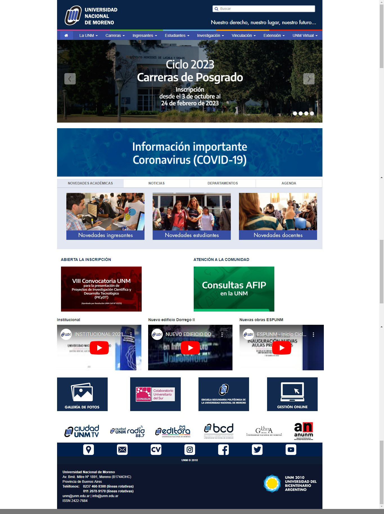

# Replicando la homepage de la UNM

En este proyecto se busca conseguir una hompage basada en la web oficial de la Universidad Nacional de Moreno[^1], 
tomando la libertad de aplicar cambios en pos de mejorar la versión original y sin perder la esencia de la misma[^2]

## Caracteristicas

- Incremento del ancho de la web para una mejor visualización en pantallas modernas
- Corrección de errores de centrado en distintos elementos y secciones.
- Inclusión del slider principal en versión móvil.
- Se adaptó correctamente todas las secciones a diseño responsive. 

## Layout a replicar

[^1]: Proyecto realizado unicamente con fines educativos.

[^2]: Los cambios realizados no representan una crítica malintencionada. 

