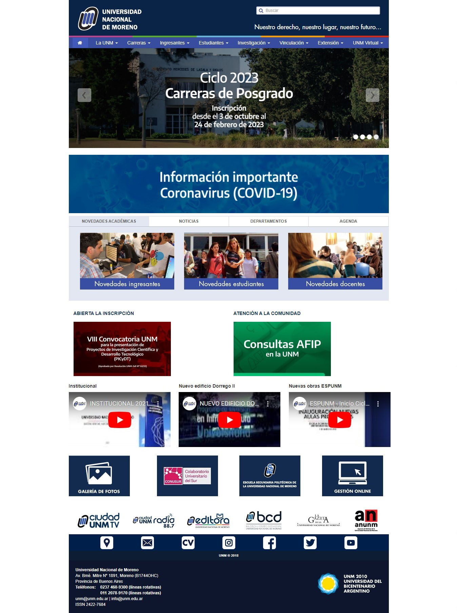

# Replicando la homepage de la UNM

Este proyecto consiste en realizar una homepage basada en la web oficial de la UNM[^1], aplicando cambios en pos de mejorar la versión original y sin perder la esencia de la misma[^2].

## Características

- Incremento del ancho de la web para una mejor visualización en pantallas modernas
- Corrección de errores de centrado en distintos elementos y secciones.
- Inclusión del slider principal en versión móvil.
- Se adaptó correctamente todas las secciones a diseño responsive. 

## Layout original

[^1]: Proyecto realizado unicamente con fines educativos.
[^2]: Los cambios realizados no representan una crítica malintencionada. 

